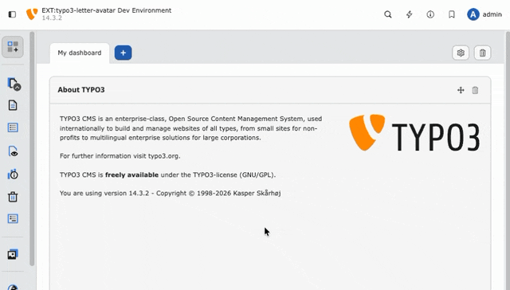

# Configuration

> **Note:** Examples below apply to TYPO3 v13.4 LTS and v14.x. For v11/v12 compatibility, use the 1.x line of this extension.

## Extension Configuration

Configure the extension via `Admin Tools > Settings > Extension Configuration > typo3_letter_avatar`:

### Color Mode
- **STRINGIFY**: Random color based on name
- **RANDOM**: Randomly selected colors from predefined list
- **THEME**: Predefined color theme
- **BACKEND_THEME** *(v14+)*: All rendered avatars follow the currently logged-in backend user's theme preference (`modern` / `fresh` / `classic`). Only effective inside the TYPO3 backend; falls back to the global `theme` setting outside of it.
- **PAIRS**: Randomly selected color pairs
- **CUSTOM**: Custom colors (code configuration only)

### Theme
Select color theme when using "Theme" mode. Available themes defined in `ext_localconf.php`.

### Font
Choose from various included font types for avatar generation.

> **Character coverage:** Not every bundled font supports the full set of Latin diacritics. Display fonts (`Norwester`, `Chewy`) ship with a Basic Latin glyph set only — names containing characters such as `É`, `Ł`, `Ä`, `Ø`, `Č`, etc. will render with empty letters. For backends with international users, prefer `OpenSans-Bold.ttf` or `NotoSans-Bold.ttf`, which cover most European Latin diacritics.

## Custom Configuration

Override default configuration in your extension:

```php
// Add custom theme
$GLOBALS['TYPO3_CONF_VARS']['EXTCONF']['typo3_letter_avatar']['configuration']['themes']['customTheme'] = [
    'foregrounds' => [
        '#FFFFFF',
        '#000000',
        '#333333',
        '#FFFAFA',
        '#F5F5F5',
    ],
    'backgrounds' => [
        '#1E90FF',
        '#32CD32',
        '#FF4500',
        '#FFD700',
        '#8A2BE2',
    ],
];

// Set custom theme (overrides extension setting)
$GLOBALS['TYPO3_CONF_VARS']['EXTCONF']['typo3_letter_avatar']['configuration']['theme'] = 'customTheme';
```

## Backend Theme Color Mode

> [!NOTE]  
> New in version 2.1. Requires TYPO3 v14 or later.



With color mode **BACKEND_THEME**, all avatars in the backend follow the theme you picked under *Admin Tools → User Settings → Backend appearance*. Switch between `modern`, `fresh` and `classic` and every rendered avatar updates accordingly — keeping the UI visually consistent.

| Theme   | Avatar background |
|---------|-------------------|
| `modern` (default) | TYPO3 blue (`#205eb5`) |
| `fresh`            | Purple (`#5033c7`)     |
| `classic`          | Orange (`#ff8700`)     |

## Available Options

See `ext_localconf.php` for complete configuration structure:
- Color modes and themes (line 44+)
- Color pairs (line 71+) 
- Predefined themes (line 107+)