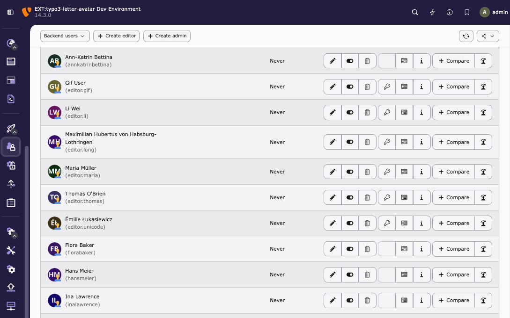

<div align="center">


# TYPO3 extension `typo3_letter_avatar`

[](https://extensions.typo3.org/extension/typo3_letter_avatar)

[](https://packagist.org/packages/konradmichalik/typo3-letter-avatar)

[](https://coveralls.io/github/konradmichalik/typo3-letter-avatar)
[](https://github.com/konradmichalik/typo3-letter-avatar/actions/workflows/cgl.yml)
[](https://github.com/konradmichalik/typo3-letter-avatar/actions/workflows/tests.yml)
[](LICENSE.md)
</div>

This TYPO3 extension generates colorful backend user avatars using name initials letter.



> [!NOTE]
> TYPO3's default backend shows the same silhouette for every user without an uploaded avatar — making large user lists hard to scan. This extension generates a colored letter avatar per user automatically: no uploads, no external services, deterministic colors per name.

## ✨ Features

* Generates out-of-the-box colorful avatars for backend users
* Easily customizable and flexible configuration
* Provides different predefined color modes and themes
* Supports frontend user avatars with an additional viewhelper


## 🔥 Installation

### Requirements

* TYPO3 13.4 LTS or 14.x
* PHP 8.2, 8.3, 8.4, or 8.5

### Compatibility

| Version | TYPO3                        | PHP                | Status                      |
|---------|------------------------------|--------------------|-----------------------------|
| 2.x     | 13.4 LTS, 14.x               | 8.2, 8.3, 8.4, 8.5 | active                      |
| 1.x     | 11.5 LTS, 12.4 LTS, 13.4 LTS | 8.1, 8.2, 8.3, 8.4 | maintenance (security only) |

### Composer

[](https://packagist.org/packages/konradmichalik/typo3-letter-avatar)
[](https://packagist.org/packages/konradmichalik/typo3-letter-avatar)

``` bash
composer require konradmichalik/typo3-letter-avatar:^2.0
```

### TER

[](https://extensions.typo3.org/extension/typo3_letter_avatar)
[](https://extensions.typo3.org/extension/typo3_letter_avatar)

Download the zip file from [TYPO3 extension repository (TER)](https://extensions.typo3.org/extension/typo3_letter_avatar).

### Setup

Set up the extension after the installation:

``` bash
vendor/bin/typo3 extension:setup --extension=typo3_letter_avatar
```

The extension will automatically generate avatars for all existing backend users.

## 🧰 Configuration

See [Configuration Documentation](Documentation/Configuration.md) for detailed setup instructions including:

* Extension settings configuration
* Custom themes and color modes
* Code-based configuration examples

## ⚡ Usage

See [Usage Documentation](Documentation/Usage.md) for comprehensive usage examples including:

* Backend user avatars (automatic)
* Programmatic avatar generation
* Fluid ViewHelper usage
* Console commands
* Event listener customization

## 🧑‍💻 Contributing

Please have a look at [`CONTRIBUTING.md`](CONTRIBUTING.md).

## 💎 Credits

This project is highly inspired by similar open source projects like [avatar](https://github.com/laravolt/avatar) and [letter-avatar](https://github.com/yohangdev/letter-avatar).

The fonts used in the extension are licensed under [SIL Open Font License](https://openfontlicense.org/) and [Apache License, Version 2.0](https://www.apache.org/licenses/LICENSE-2.0).


## ⭐ License

This project is licensed
under [GNU General Public License 2.0 (or later)](LICENSE.md).
